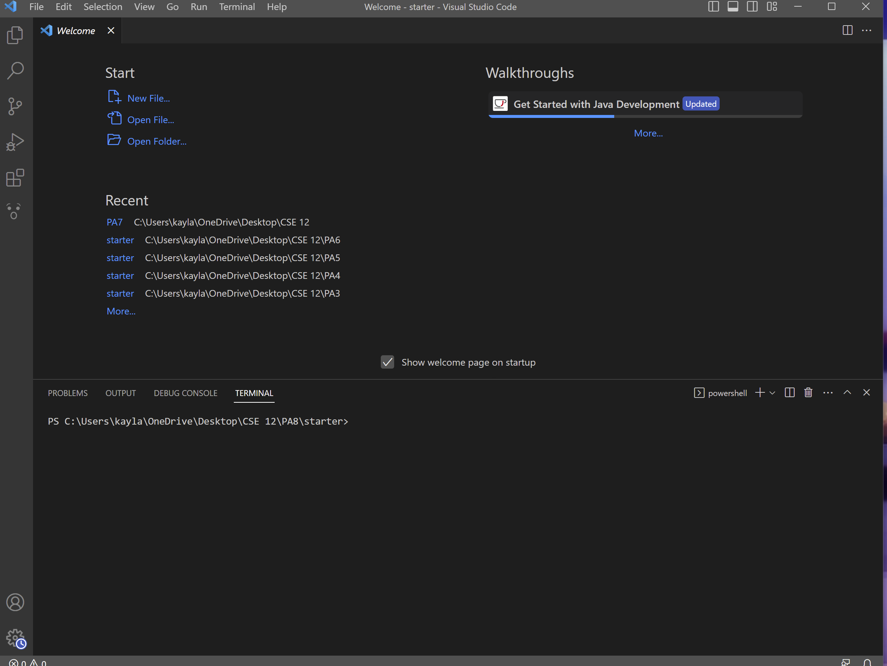
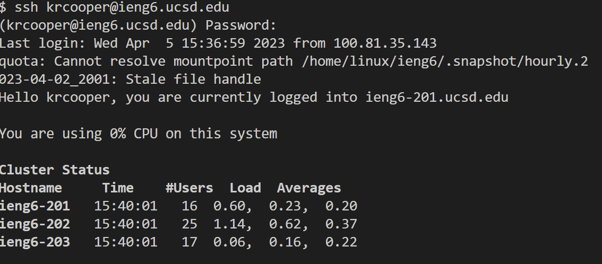
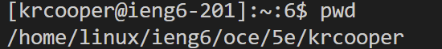

# Lab Report #1
*April 10, 2023*

>This page aims to explain how to log into a course-specific account (specifically ieng6)

Step #1: __Download/Installl VScode__

If you don't already, go to [VScode Download](https://code.visualstudio.com/download) to download
VScode, make sure to download the version that corresponds to your operating system. Install VScode
onto your computer and open it, you should get something that looks like the following screenshot.

After this, you're going to want to download [Git](https://gitforwindows.org/). Note: The link is only for
Windows systems, but the MacOS should be easy to find.

Open VScode, and type the command `Ctrl + Shift + P`. Type "Select Default Profile" and select
Git Bash. Open a new terminal and it should load as a Git Bash terminal.

Step #2: __Remotely Connecting__

Once you have successfully installed VScode and are able to open a Git Bash terminal, you'll want to sign in
using the command `ssh` followed by your username. For CSE 15L, my command line looked like `$ ssh cs15lsp23pf@ieng6.ucsd.edu`.
You'll then be prompted to enter your password, if this is the first time you are connecting to a specific server, you might 
get a message similar to this:

>The authenticity of host 'ieng6.ucsd.edu (128.54.70.227)' can't be established.
RSA key fingerprint is SHA256:ksruYwhnYH+sySHnHAtLUHngrPEyZTDl/1x99wUQcec.
Are you sure you want to continue connecting (yes/no/[fingerprint])? 

This is normal and expected for your first time, if this continues after logging in multiple times, there might be an issue that you should 
address with the server's host. So type "yes" and you should (hopefully) receive a message along these lines:

Once you get a message like this, that means you have successfully connected to the server! Good job!

Step #3: __Try Running Some Commands__

In order to feel more comfortable, try running some basic commands in your terminal. For example, when I
used the command `pwd` (used to print the full path name of the current directory, I received the following
output.

You can try commands such as the following in order to play around!
* `cd`
* `cd ~`
* `ls -lat`
* `ls -a'

