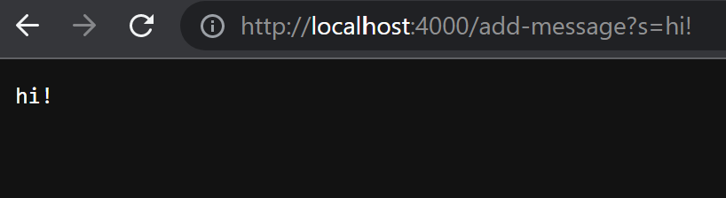
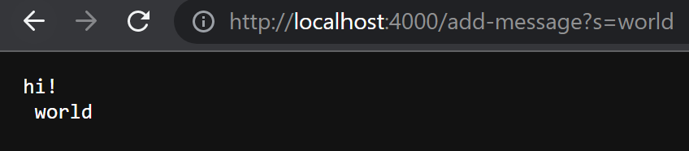
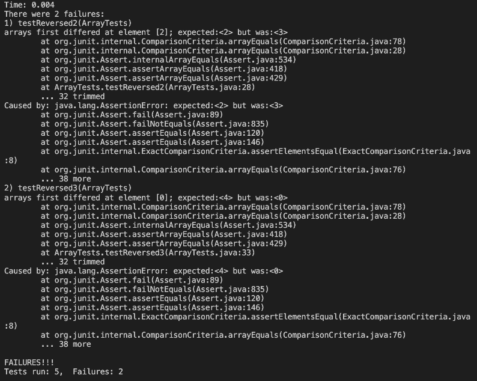

# Lab #2 Servers and Bugs
*April 24, 2023*

>Part 1: String Server

The following code block contains my StringServer.java code. The methods will open a web server and the user can add messages to the page by adding 
`add-message?s=<Message>` to the URL

```
import java.io.IOException;
import java.net.URI;
import java.util.ArrayList;

class Handler implements URLHandler{

    ArrayList<String> messages = new ArrayList<>();
    public String handleRequest(URI url) {
        String formattedString = url.toString();
        String[] parameters = formattedString.split("=");

        if (url.getPath().equals("/")) {
            return " ";
        }
        else if (parameters[0].contains("/add-message?s")) {
            messages.add(parameters[1] + "\n");
            return messages.toString().replace(","," ").
            replace("["," ").replace("]",
            " ");
        }
        return "404 Not Found!";

    }

    class StringServer {
        public static void main(String[] args) throws IOException {
            if(args.length == 0){
                System.out.println("Missing port number! Try any number between 1024 to 49151");
                return;
            }
    
            int port = Integer.parseInt(args[0]);
    
            Server.start(port, new Handler());
        }
    }
}
```

The following screenshots show the behavior of StringServer.java.


In the above example, when `/add-message?s=hi!` is called the main method opens up a new 
`Handler()` object, once `add-message?s=hi!` is called, `handleRequest()` is called which uses 
`add-message?s=hi!` as a parameter to concantinate the correct part of the path to the server. 
During this call, the ArrayListmessages is empty, and the path gets split and added to the list 
parameters as `[add-message?s, hi!]`, where `add-message?s` is recognized as the add command and 
consequently `hi!` is added to messages and the contents of messages is then returned.



The above screenshot shows the results of a second call, `/add-message?s=world`. The main method 
opens up a new `Handler()` object, once `add-message?s=world` is called, `handleRequest()` is 
called which uses `add-message?s=world` as a parameter to concantinate the correct part of the 
path to the server. During this call, the ArrayList messages contains the string `hi!` from the 
previous call, and the path gets split and added to the list parameters as `[add-message?s, 
world]`, where `add-message?s` is recognized as the add command and consequently `world` is 
added to messages and the contents of messages is then returned.

>Part 2: Lab 3 Bugs

The reversed() method given originally is shown below. It's goal is to take in an array and return a 
new array with the elements in reversed order.

```
  static int[] reversed(int[] arr) {
    int[] newArray = new int[arr.length];
    for(int i = 0; i < arr.length; i += 1) {
      arr[i] = newArray[arr.length - i - 1];
    }
    return arr;
  }
```
After trying multiple JUnit Tests, I deduced that the code would only work in empty and one-element 
arrays, such as { } or {3}. 
```
@Test
 public void testReversed1() {
   int[] input1 = { };
   ArrayExamples.reverseInPlace(input1);
   assertArrayEquals(new int[]{ }, input1);
 }
```
But wouldn't work any bigger arrays, such as {1,2,3,4}.
```
@Test
 public void testReversed3() {
   int[] input1 = {1, 2, 3, 4};
   assertArrayEquals(new int[]{4, 3, 2, 1}, ArrayExamples.reversed(input1));
 }
```
As shown when only the empty/one-element arrays passed the JUnit tests, while the other arrays
did not.



After the testing, I realized that there were two bugs causing the symptoms. The original assigned 
the elements of the new array to the original array (instead of vice versa) and also returned the 
original array rather than the new array. After fixing this, the working code looked like the 
following.

```
  static int[] reversed(int[] arr) {
    int[] newArray = new int[arr.length];
    for(int i = 0; i < arr.length; i += 1) {
      newArray[arr.length - i - 1] = arr[i];
    }
    return newArray;
  }
```

This works because now the for loop is assigning the elements in reverse order to the correct (new) array, and the method itself is returning the correct array.

>Part 3: What I Learned

Prior to week #2's lab and Lab Report #2, I had never used URLHandlers, ports, or any of the  
methods/classes we used. Considering the whole concept was new to me, I learned a lot about the basics of web servers and how to manipulate them and their methods to produce different outputs.
