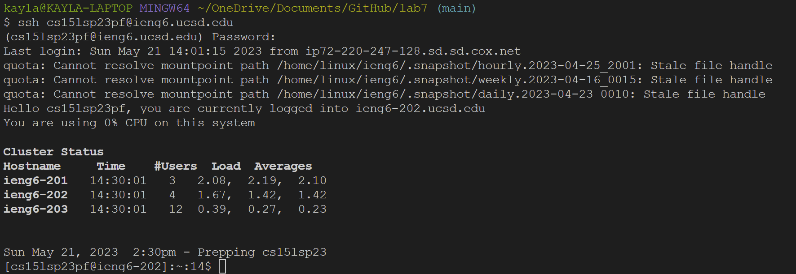
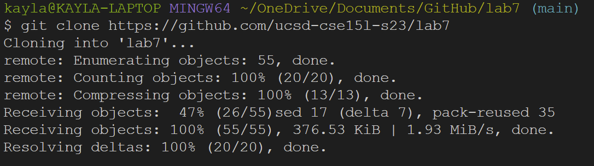
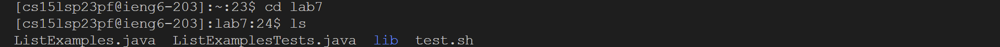
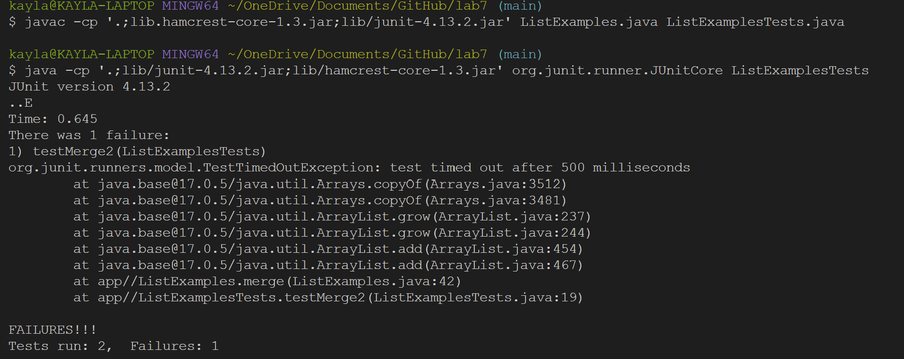
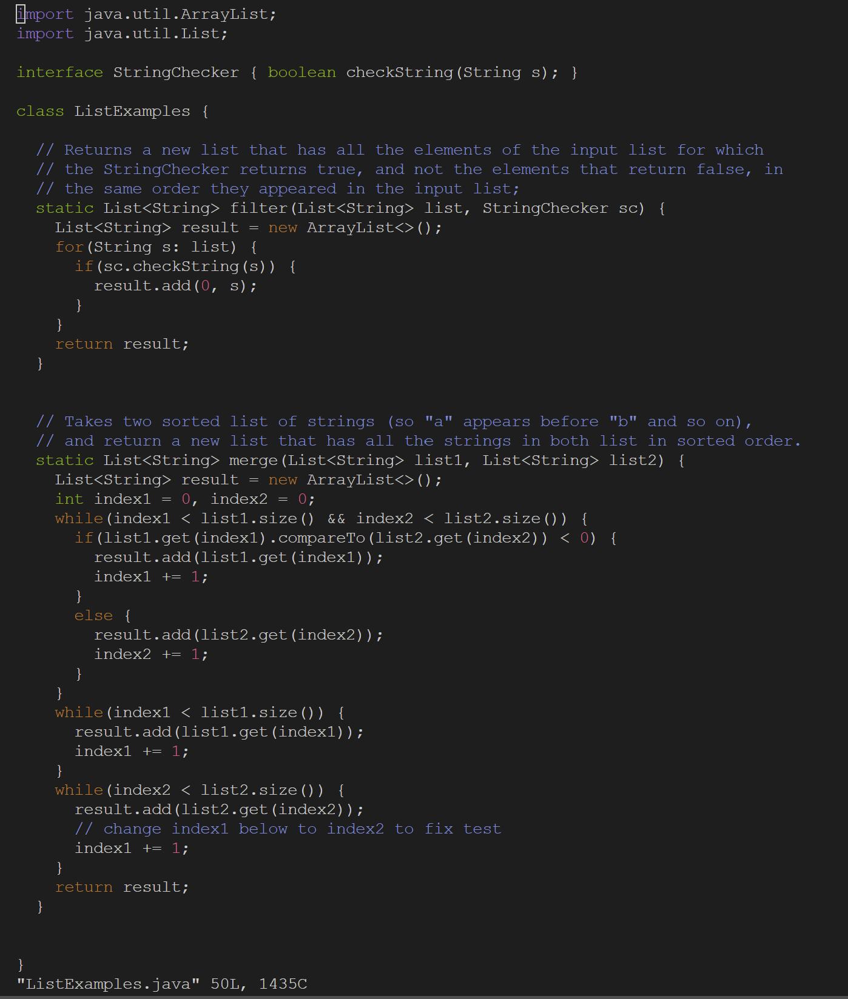
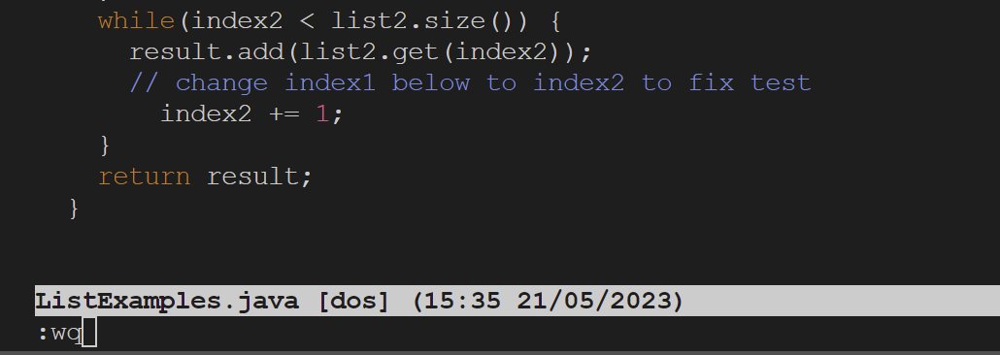
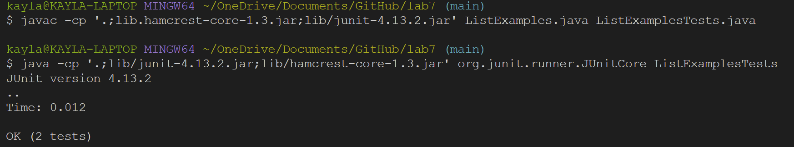
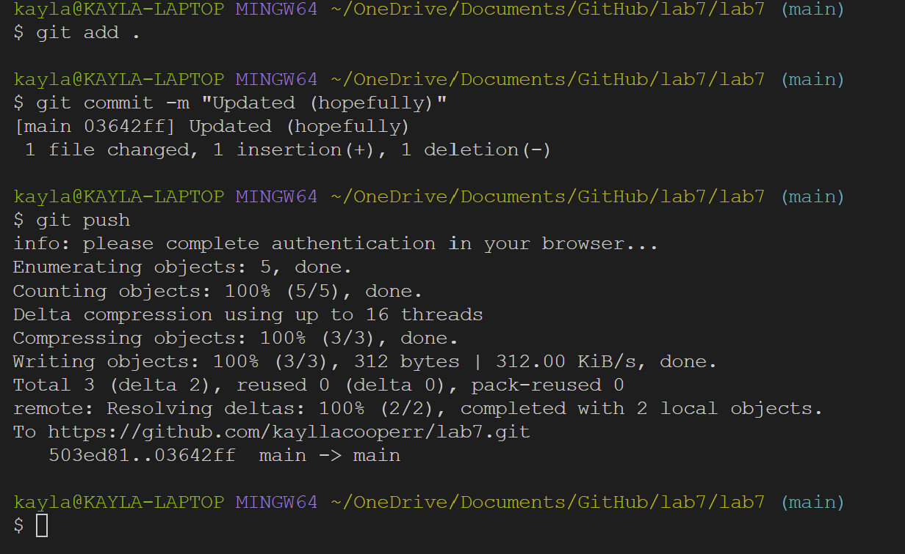

## Lab #4
*May 22, 2023*

> Part 1: Reproducing Tasks

For this lab report, I am reproducing the tasks from Week 7's lab activities. Below will
contain a screenshot of every step and the keys I used to complete the tasks.

## Step 4: Log Into ieng6

Keys Used: `ssh cs15lsp23pf@ieng6.ucsd.edu <enter> *password* <enter>` 
Because I was using a fresh terminal I had to manually enter my username and password in order to login.

## Step 5: Clone the fork of the repository

Keys Used: `Ctrl-C Ctrl-V <enter>`
I copied the command `git clone https://github.com/kayllacooperr/lab7.git` from the lab write up and pasted it into my terminal.

## Step 6: Run the Tests (They will fail)

Keys Used: `<cd lab7 ls <up> <up> <enter> <up> <up> <enter>`
I used the current directory command to navigate to the lab 7 folder, and then I used ls to confirm I was in the correct 
location. The commands to compile and run ListExamples/ListExamplesTests, and the junit tests were already in my search 
history (2 lines up), so I used the up arrows to access it.

## Step 7: Correct ListExamples.java

Keys Used: `vim ListExamples.java <enter> jjjjjjjjjjjjjjjjjjjjjjjjjjjjjjjjjjjjjjjjjjjlllllllllllxi2 <esc> :wq`
I used the `vim` command to open ListExamples.java. My cursor began at the top left of the file, so I and the had to go 
down 43 lines, right 11 characters to reach the character I needed to change. I then used `x` to remove the 1 and then 
`i 2` to insert 2. I then went back to normal mode using `esc` and used `:wq` to save and quit vim.

## Step 8: Run the Tests (They will pass)

Keys Used: Keys Used: `<up> <up> <enter> <up> <up> <up> <enter>`
Since I had recently used the compile/run commands, I used the arrow keys to access them from my search history, with the compile command being in the second line and
the run command being in the third line.

## Step 9: Commit and Push the Changes.

Keys Used: `git add . <enter> git commit -m "Updated! <enter> git push`
Using the above commands, I added my changes to the index, committed them with the message "Updated (hopefully)" and then pushed my changes. 
