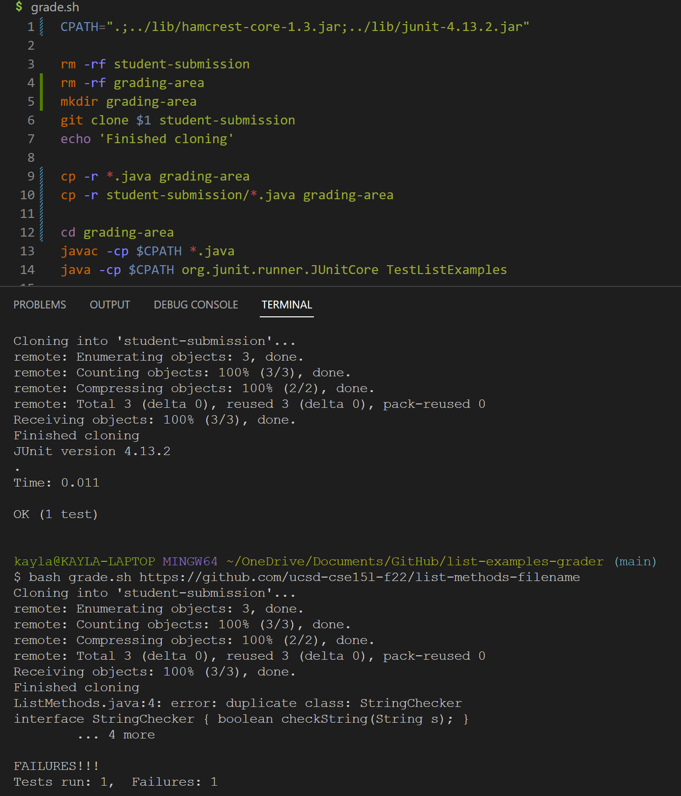
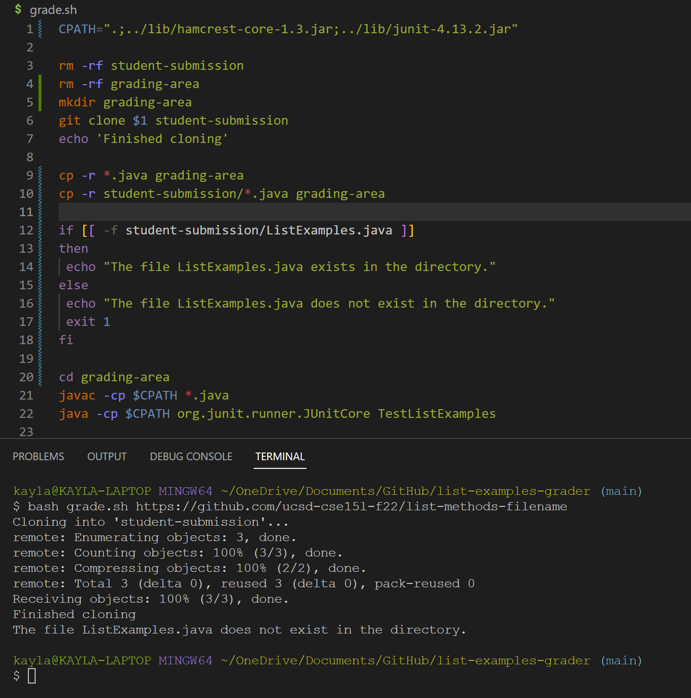

## Lab #5
*June 5, 2023*

> Part 1: Debugging Scenario

1. Initial Post
Title: Grade.sh failing
What environment are you using (computer, operating system, web browser, terminal/editor, and so on)?

I am using my personal laptop and VSCode. Specifically I am in the list-examples-grader repository.

Detail the symptom you're seeing. Be specific; include both what you're seeing and what you expected to see instead. 
Screenshots are great, copy-pasted terminal output is also great. Avoid saying “it doesn't work”.

I am attempting to run my grade.sh file with the repository "https://github.com/ucsd-cse15l-f22/list-methods-filename". 
And the grader fails with 5 errors, including one about a duplicate class. I'm not sure what this means, as it executes correctly for the repository with completely correct code. 
I've attached a screenshot, where the first output is a result of running grade.sh with "https://github.com/ucsd-cse15l-f22/list-methods-corrected" and the 
second output being "https://github.com/ucsd-cse15l-f22/list-methods-filename". 

Detail the failure-inducing input and context. That might mean any or all of the command you're running, a test case, command-line arguments, working directory, 
even the last few commands you ran. Do your best to provide as much context as you can.

I ran the command 'bash grade.sh https://github.com/ucsd-cse15l-f22/list-methods-filename' and expected all JUnit Tests to pass. Please see the screenshot for further info.

 

2. TA Response
"Hi Kayla, It looks like the repository you're having issues with has all the correct code to pass the tests, except for the name of the file. Looking at the repository shows that
the filename is ListMethods.java, rather than ListExamples.java. Your Grade.sh should ideally have a specific block of code to handle this situation, along with an output that would
signal to the grader/student that the file name is incorrect. (Hint: An if statement could prove useful here!)"

3. Student's Fix
"Thanks for the help! I added an if/else statement in order to check that the file copied does have the correct name, and that was able to solve my bug. I attached a screenshot again!"

 

> Part 2: Reflection

My favorite thing I learned about in the second half of this quarter is vim, and all of its particular uses. I had no idea that vim even existed before it was mentioned in this class, but after playing
around with it on my own time I was able to get used to it enough to use it day to day. Fun side note, my dad who is a software engineer for LEIDOS uses vim for his work too! He was showing my his own uses for it, so I'm
excited that this is something that will prove useful in my future career.
